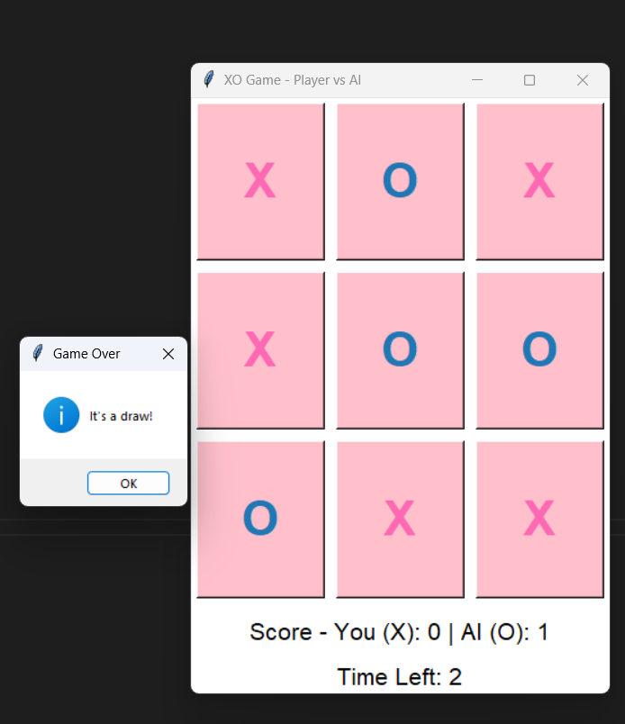

# 🎮 XO Game - Player vs AI

A Tic Tac Toe desktop game developed in Python using Tkinter.

The player competes against an AI that uses the Minimax algorithm to make the best possible moves.

---

## Features

- 🎮 Player vs AI
- 🤖 AI powered by the Minimax algorithm
- ⏱️ 30-second countdown timer
- 📊 Live score tracking
- 🔄 Automatic game reset
- 🎨 Simple and clean Tkinter GUI

---

## Screenshot



---

## Technologies Used

- Python
- Tkinter
- Minimax Algorithm

---

## How to Run

```bash
python "Project Ai (XO Game).py"
```

---

## Author

**Doaa Abdelsattar**
